# 裸机下驱动MPU6050模块

## 软件IIC通信

### *配置GPIO口

由于软件IIC是用GPIO口手动翻转电平实现的的协议，并不需要STM32内部的外设资源支持，所以只需任选两个普通的GPIO口，在程序中配置并操作SCL和SDA对应的端口即可。即**端口不受限，可任意指定**。  
**选择SCL接PB10，SDA接PB11，初始化GPIOB并将PB10和PB11配置成开漏输出模式：**  

```C
RCC_APB2PeriphClockCmd(RCC_APB2Periph_GPIOB,ENABLE);
	
	GPIO_InitTypeDef GPIO_InitStructure;
	GPIO_InitStructure.GPIO_Mode = GPIO_Mode_Out_OD;
	GPIO_InitStructure.GPIO_Pin = GPIO_Pin_10 | GPIO_Pin_11;
	GPIO_InitStructure.GPIO_Speed = GPIO_Speed_50MHz;
	GPIO_Init(GPIOB, &GPIO_InitStructure);
``` 

然后**依据IIC通信协议，改变这两个端口的电平，实现单片机和MPU6050互相交流。**  
IIC时序起始条件需要在SCL，SDA均处于高电平时拉低SDA电平，所以先释放总线，将Pin10和Pin11都置高电平，让SCL和SDA都处于空闲状态。  

```C
GPIO_SetBits(GPIOB, GPIO_Pin_10 | GPIO_Pin_11);
``` 

完整IIC初始化如下：  

```C
void MyI2C_Init(void)
{
RCC_APB2PeriphClockCmd(RCC_APB2Periph_GPIOB,ENABLE);
	
	GPIO_InitTypeDef GPIO_InitStructure;
	GPIO_InitStructure.GPIO_Mode = GPIO_Mode_Out_OD;
	GPIO_InitStructure.GPIO_Pin = GPIO_Pin_10 | GPIO_Pin_11;
	GPIO_InitStructure.GPIO_Speed = GPIO_Speed_50MHz;
	GPIO_Init(GPIOB, &GPIO_InitStructure);
	
	GPIO_SetBits(GPIOB, GPIO_Pin_10 | GPIO_Pin_11);
}
```

接下来完成IIC时序基本单元。 
### *IIC通信协议时序基本单元
第一个，**起始条件。波形如下**：   
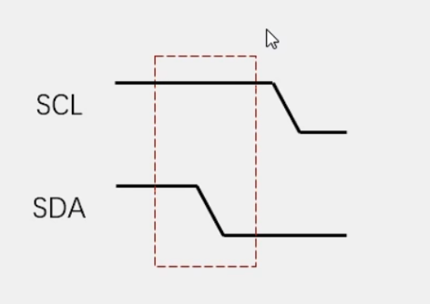  
为了方便定义函数封装SCL和SDA，实现函数名称和端口号的替换，保险起见调用延时函数。  

```C
void MyI2C_W_SCL(uint8_t BitValue)
{
	GPIO_WriteBit(GPIOB, GPIO_Pin_10, (BitAction)BitValue);
    Delay_us(10);
}

void MyI2C_W_SDA(uint8_t BitValue)
{
	GPIO_WriteBit(GPIOB, GPIO_Pin_11, (BitAction)BitValue);
    Delay_us(10);
}

uint8_t MyI2C_R_SDA(void)
{
    uint8_t BitValue;
	BitValue=GPIO_ReadInputDataBit(GPIOB,GPIO_Pin_11);
	Delay_us(10);
	return BitValue;
}
``` 

**使SCL，SDA释放，处于高电平，先拉低SDA，再拉低SCL。**  

```C
void MyI2C_Start(void)
{
    MyI2C_W_SDA(1);
	MyI2C_W_SCL(1);
	MyI2C_W_SDA(0);
	MyI2C_W_SCL(0);
}
``` 

保险起见先释放SDA，因为SDA电平可能不确定。  
接下来，**终止条件，波形如下**：  
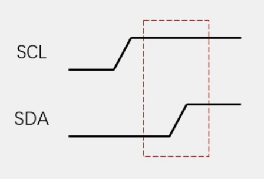  
**先拉低SDA，再释放SCL，再释放SDA。**（因为在该时序单元开始时SDA不一定是低电平）  

```C
void MyI2C_Stop(void)
{
    MyI2C_W_SDA(0);
	MyI2C_W_SCL(1);
	MyI2C_W_SDA(1);
}
``` 

**发送一个字节，波形如下**  
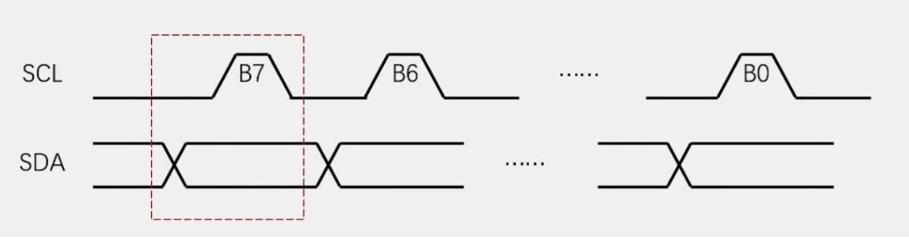  
SCL低电平期间，主机将数据位依次放到SDA线上(高位先行)，然后释放SCL，从机将在SCL高电平期间读取数据位所以SCL高电平期间SDA不允许有数据变化，依次循环上述过程8次即可发送一个字节。取出最高位可以这样：  

```C
Byte & 0x80
```

*0x80是1000 0000，与任意数据xxxx xxxx按位与，结果就是x000 0000.* 取出次高位即  

```C
Byte & 0x40
``` 

每次将一位数据放在SDA线上后，释放SCL，从机会立刻将数据读走，再拉低SCL，放下一位数据。重复复制粘贴8次过于麻烦，所以用for循环，每进行一次循环后将0x80右移1位。**最终发送一个字节的完整代码如下：**  

```C
void MyI2C_SendByte(uint8_t Byte)
{
    uint8_t i;
    for(i=0;i<8;i++)
	{
		MyI2C_W_SDA(Byte & (0x80>>i));
	    MyI2C_W_SCL(1);
	    MyI2C_W_SCL(0);
	}
}
``` 

由于BitValue函数的参数具有非0即1的性质，所以按位与的计算结果是0x00即为0，不为0x00即为1。  
**接收一个字节，波形如下：**  
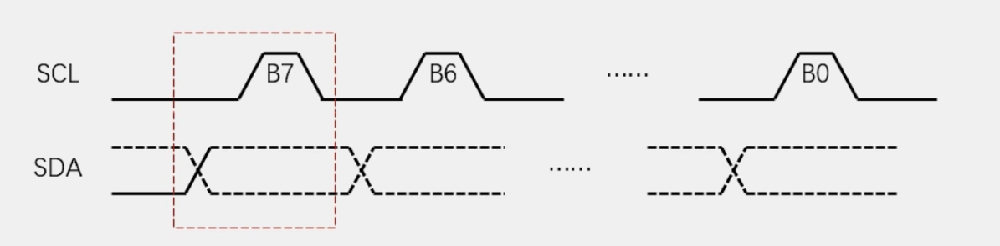  
SCL低电平期间，从机将数据位依次放到SDA线上(高位先行)，然后释放SCL，主机将在SCL高电平期间读取数据位所以SCL高电平期间SDA不允许有数据变化，依次循环上述过程8次即可接收一个字节(主机在接收之前，需要释放SDA)。  
要实现该时序单元，可以先让主机释放SDA，从机将数据放到SDA，此时主机释放SCL，SCL高电平主机就能读取数据了。读取数据时，可以定义一个0x00，或数据，如果读到1，或运算后数据这一位就是1；若读到0，条件不成立，依然是0x00，相当于这一位写入0。同样用for循环重复8次，**完整代码如下：**  

```C
uint8_t MyI2C_ReceiveByte(void)
{
    uint8_t i,Byte=0x00;
	MyI2C_W_SDA(1);
	for(i=0;i<8;i++)
	{
		MyI2C_W_SCL(1);
	    if(MyI2C_R_SDA()==1){Byte |= (0x80>>i);}
	    MyI2C_W_SCL(0);
	}
	return Byte;
}
``` 

**发送应答**  
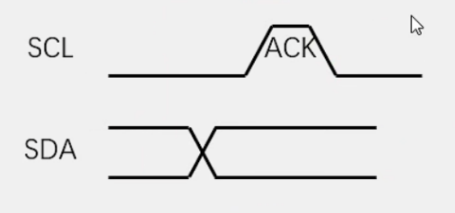  
主机在接收完一个字节之后在下一个时钟发送*一位*数据，数据0表示应答，数据1表示非应答。  
SCL低电平时，主机把应答的一位数据放到SDA上，SCL高电平读取应答，SCL低电平，进入下一个时序单元。  

```C
void MyI2C_SendAck(uint8_t AckBit)
{
    MyI2C_W_SDA(AckBit);
	MyI2C_W_SCL(1);
	MyI2C_W_SCL(0);
}
```  

**接收应答**  
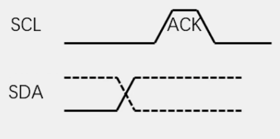  
主机在发送完一个字节之后,在下一个时钟接收一位数据，判断从机是否应答，数据0表示应答，数据1表示非应答(主机在接收之前，需要释放SDA)。  
SCL低电平时，主机释放SDA，从机将应答位放到SDA上，SCL高电平，主机读走应答位，SCL低电平，进入下一个时序单元。  

```C
uint8_t MyI2C_ReceiveAck(void)
{
    uint8_t AckBit;
	MyI2C_W_SDA(1);
	MyI2C_W_SCL(1);
	AckBit = MyI2C_R_SDA();
	MyI2C_W_SCL(0);
	return AckBit;
}
``` 

这样，就完成了软件模拟IIC通信的底层函数书写。

## 驱动MPU6050

MPU6050是一个6轴姿态传感器，可以测量芯片自身X、Y、Z轴的加速度、角速度参数，通过数据融合，可进一步得到姿态角，常应用于平衡车、飞行器等需要检测自身姿态的场景.

3轴加速度计 (Accelerometer) : 测量X、Y、Z轴的加速度。

3轴陀螺仪传感器(Gyroscope)：测量X、Y、Z轴的角速度。

为了让芯片正常运行，需要配置一些**寄存器**。查看MPU6050的寄存器手册：

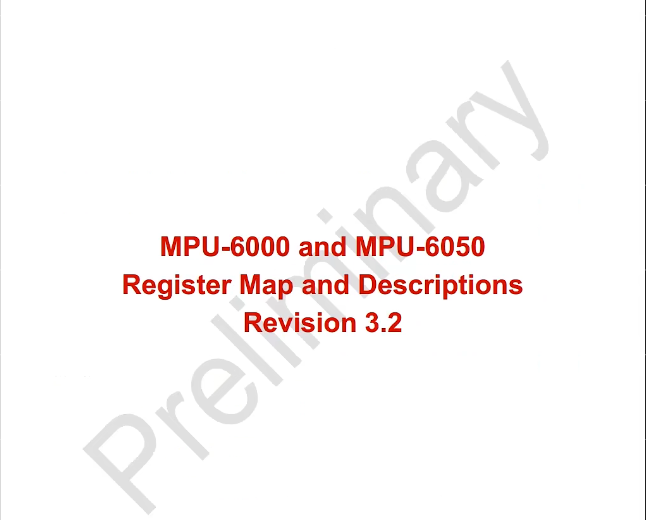

翻到寄存器总表，可以看到MPU6050的全部寄存器：

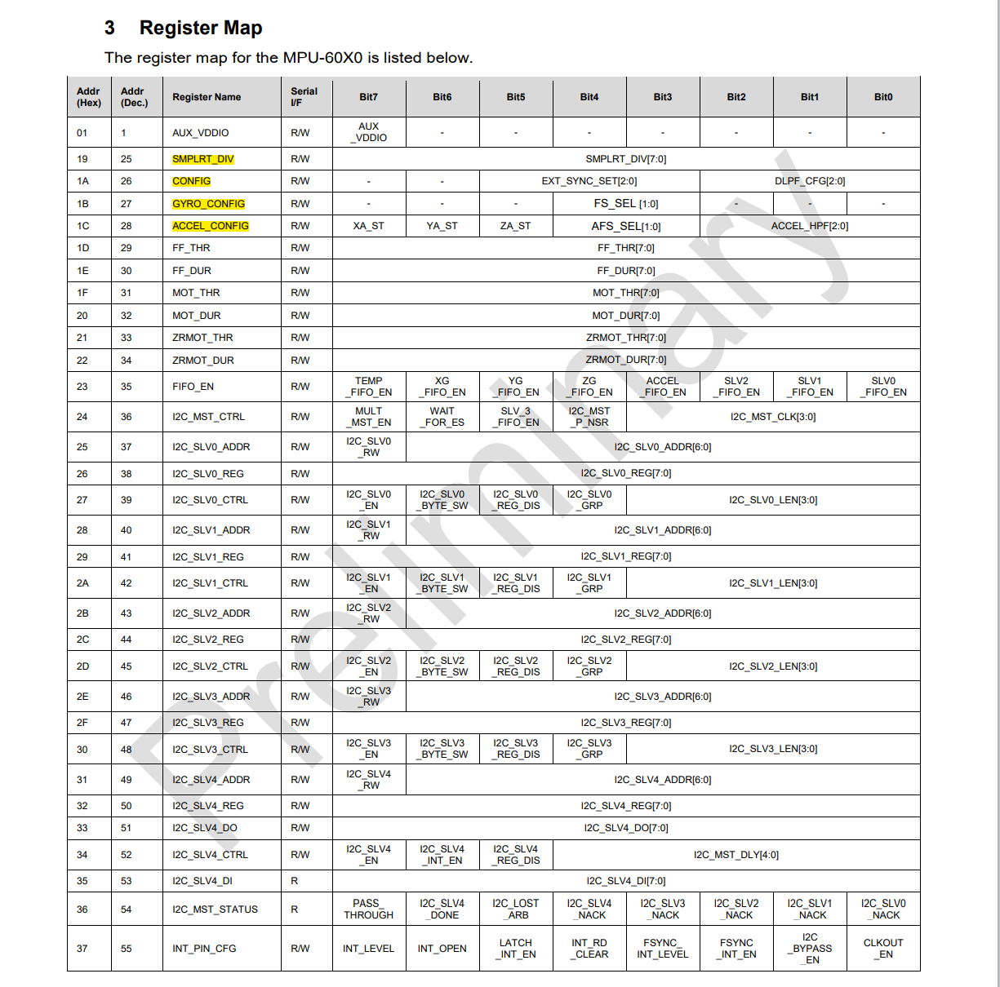

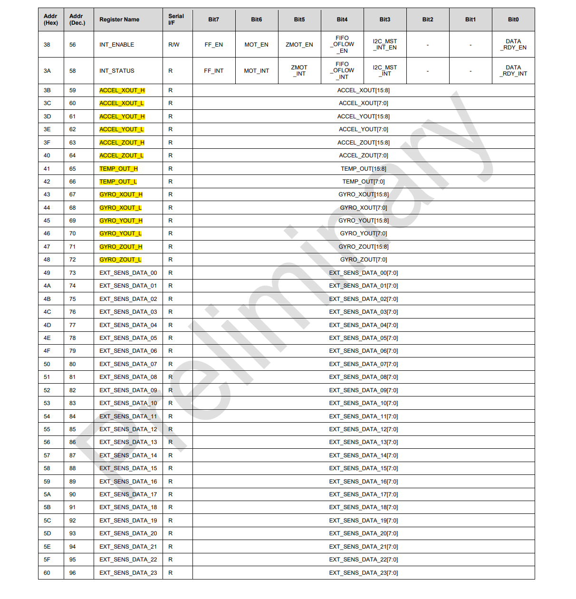

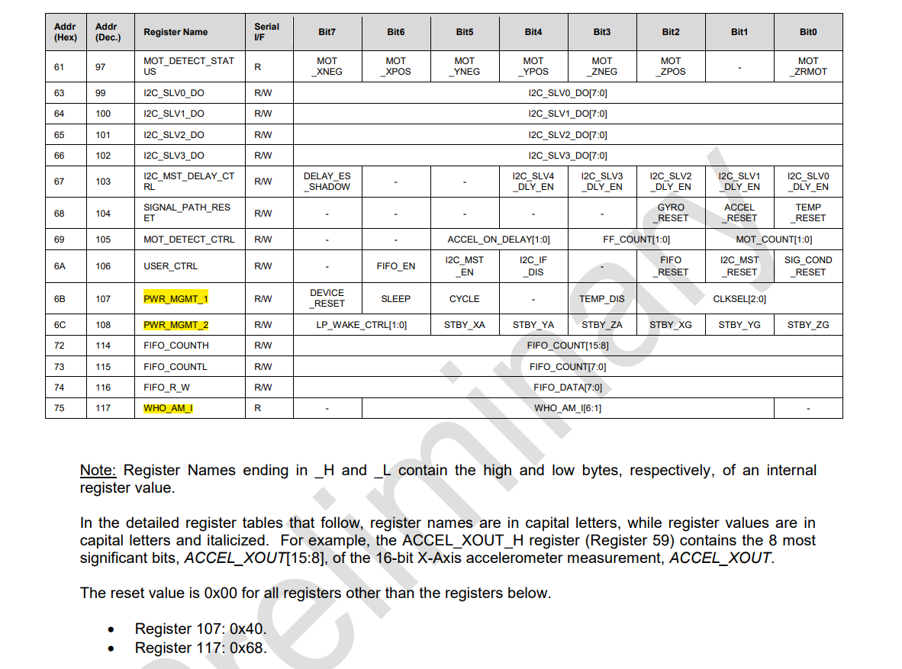

表格第一列是16进制表示的寄存器地址；第二列是10进制表示的寄存器地址；第三列是寄存器的名称；第四列是读写权限，R/W可读可写，R只读；后面几列是寄存器内每一位的名字，每个寄存器都是8位的。

要实现MPU6050的简单应用，只需要了解其中标黄的寄存器即可。接下来查看每个寄存器的说明：

1.采样频率分频器

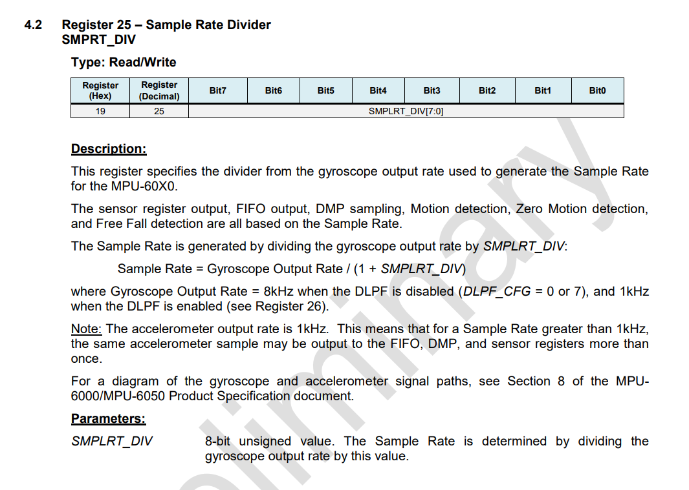

寄存器内八位数据是一个整体，作为分频值。这个寄存器可以配置采样频率的分频系数，分频越小，内部AD转换越快，数据寄存器刷新越快，反之则越慢。

2.配置寄存器

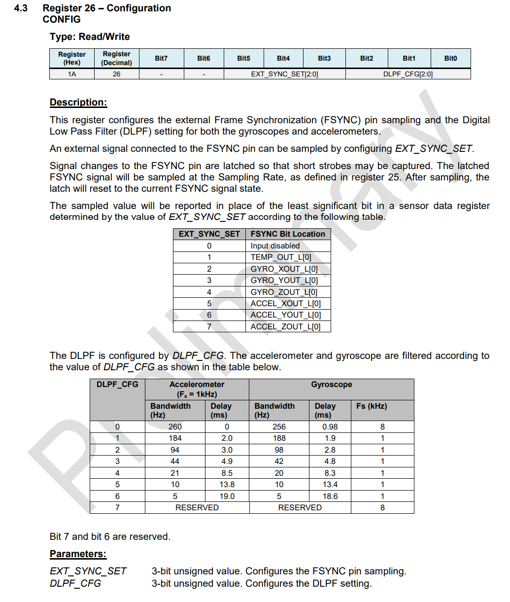

该寄存器内部分为两部分，外部同步设置和低通滤波器配置。低通滤波器可让输出数据更平滑，配置滤波器参数越大，输出数据抖动越小，0是不适用低通滤波器。不使用滤波器陀螺仪时钟位8KHZ，使用滤波器陀螺仪时钟为1KHZ。

3.陀螺仪配置寄存器

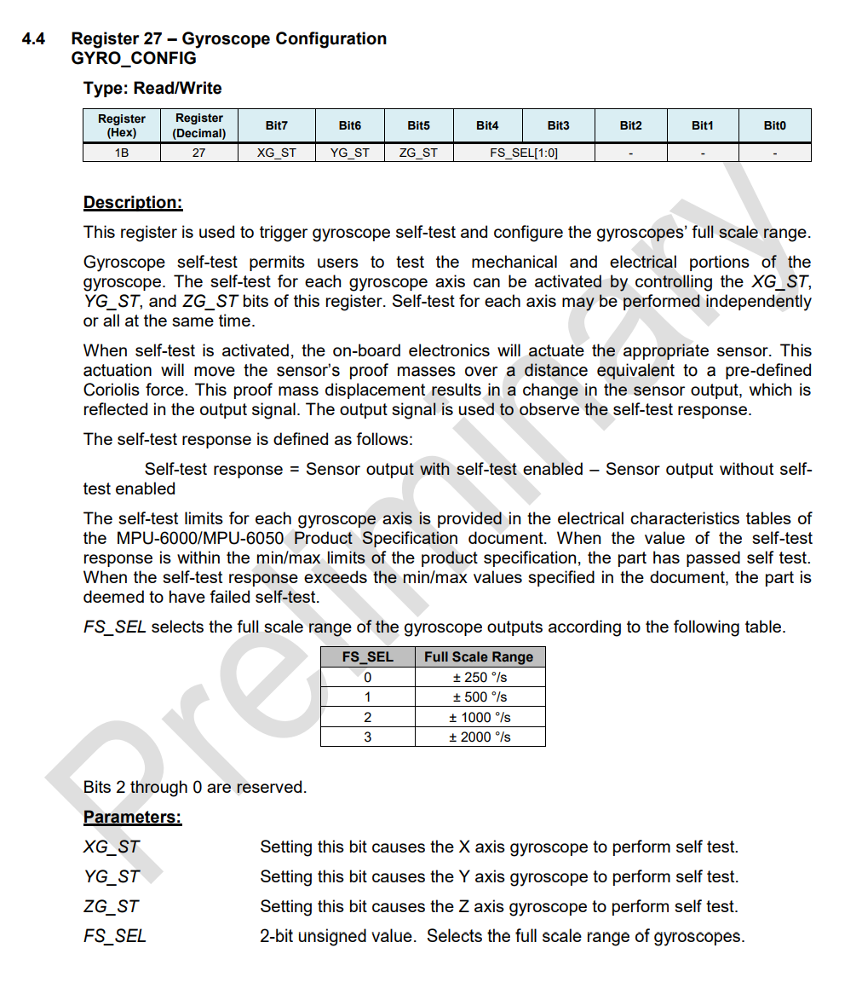

高三位是XYZ轴的自测使能位，中间两位是满量程选择位，后三位没用到。自测响应=自测使能时的数据-自测失能时的数据。上电后，先使能自测读取数据，再失能自测读取数据，两者相减得到自测响应，若自测响应在范围内，说明芯片通过自测，可以正常使用。查阅MPU6050产品说明书的电气特征表，可知自测相应范围：


根据手册，满量程选择可选择四种，量程越大范围越广，量程越小分辨率越高。

4.加速度计配置寄存器

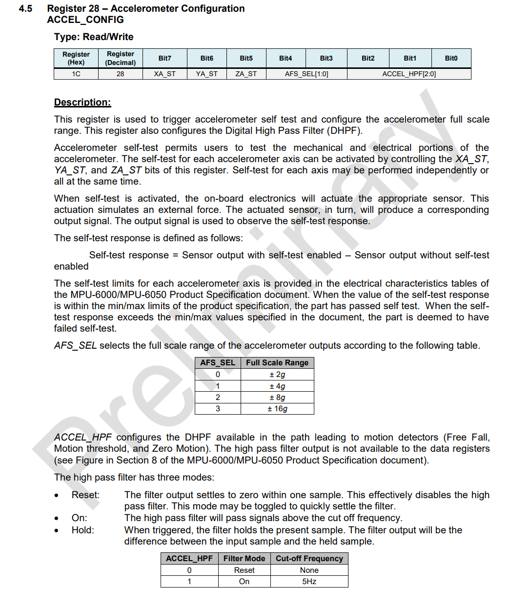

高三位自测使能位，中间两位满量程选择，后三位用来配置高通滤波器（暂时用不到）。

5.加速度计数据寄存器、温度传感器、陀螺仪数据寄存器器

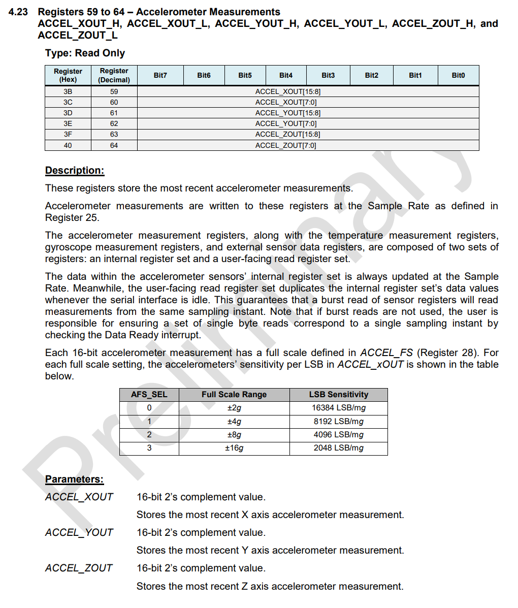

**读取加速度数据**、**温度数据**、**角速度数据读取这三个寄存器**。数据是一个16位的有符号数，以二进制补码的方式储存，读取时读出高八位和低八位，高位左移八次或上低位数据，存在一个int16_t的变量里即可。

6.电源管理寄存器1

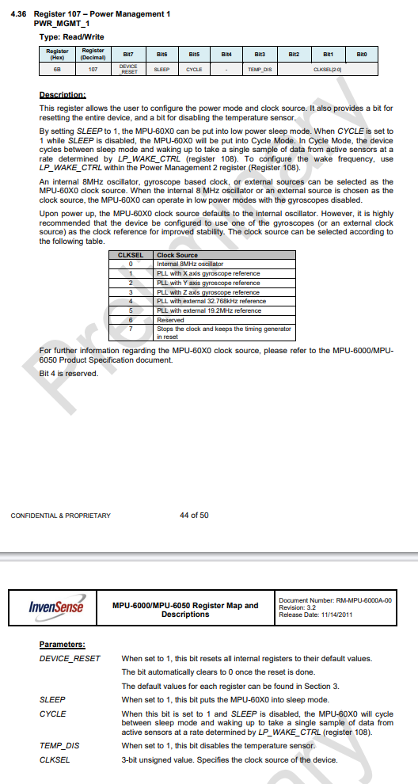

第一位设备复位，这一位写1所有寄存器都恢复到默认值；第二位睡眠模式，这一位写1芯片睡眠，不工作进入低功耗；第三位循环模式，这一位写1设备进入低功耗，隔一段时间启动一次，唤醒频率由电源管理寄存器2前两位控制；第四位无；第五位写1禁用内部的温度传感器；后三位用来选择系统时钟来源，见表，陀螺仪的晶振更精确，建议选择。

7.电源管理寄存器2

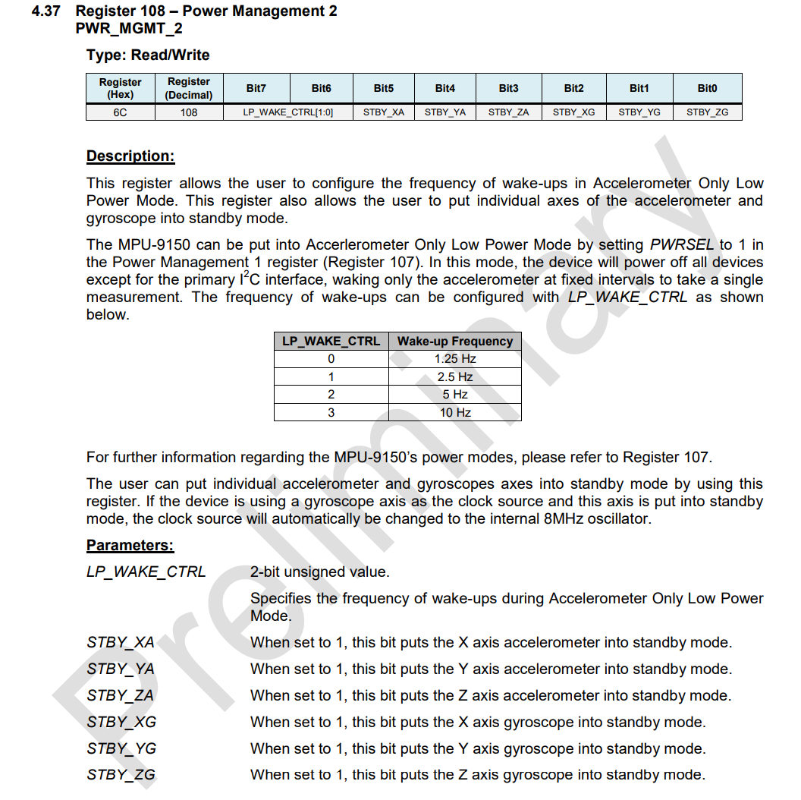

前两位控制循环模式的唤醒频率；后六位分别控制六个轴进入待机模式。

8.Who Am I

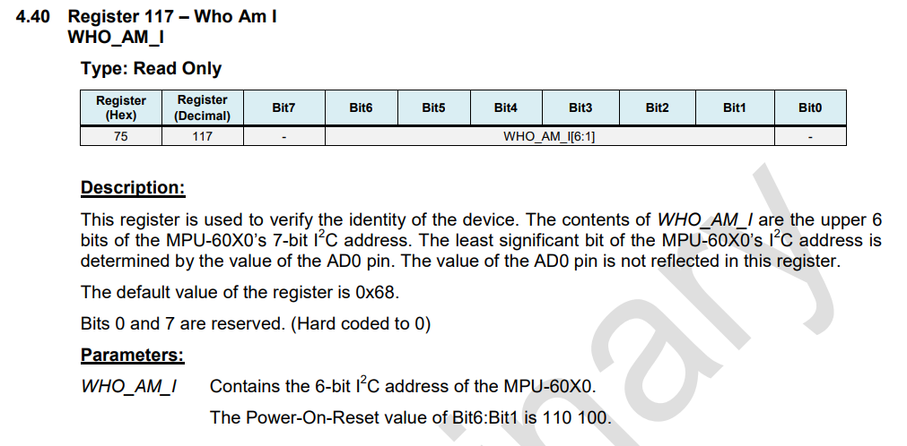

只读寄存器，存储ID号，中间六位固定为110100，ID号实际为芯片的IIC地址，最高位和最低为都是0，读出该寄存器值固定为0x68。注意AD0引脚对IIC地址进行的配置不会改变ID号最低位，读出ID号始终为0x68。

所有寄存器上电默认值都是0x00，除了107号：0x40（电源管理寄存器1）、117号：0x68（ID号）。
即芯片管理寄存器1上电默认次高位为1，睡眠模式，**上电后需先解除睡眠，否则操作其他寄存器是无效的。**

为了实现对寄存器的读写，先封装IIC时序：

在hardware里新建MPU6050.c和.h模块，注意.c模块要包含MyI2C.h，因为MPU6050模块建立在MyI2C之上。

.png)

初始化MPU6050，并初始化底层的MyI2C。

```C
void MPU6050_Init(void)
{
	MyI2C_Init();
}
```

在上面进行函数封装。

1.指定地址写一个字节

对于指定设备在指定地址下写入指定数据：

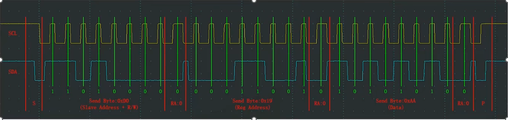

该时序由IIC时序基本单元起始条件、发送一个字节、接收应答、终止条件拼接而成。具体的实现过程是起始，发送一个内容是从机地址+读写位的字节，接收应答，发送第二个字节指定寄存器地址，接收应答，发送第三个字节指定要写入寄存器的数据，接收应答，终止。

```C
#define MPU6050_ADDRESS 0xD0

void MPU6050_WriteReg(uint8_t RegAddress,uint8_t Data)
{
	MyI2C_Start();
	MyI2C_SendByte(MPU6050_ADDRESS);
	MyI2C_ReceiveAck();
	MyI2C_SendByte(RegAddress);
	MyI2C_ReceiveAck();
	MyI2C_SendByte(Data);
	MyI2C_ReceiveAck();
	MyI2C_Stop();
}
```

两个参数是寄存器地址和要写入的数据，为了突出发送的第一个字节是从机地址，使用宏定义将0xD0替换为MPU6050_ADDRESS。

2.指定地址读一个字节

对于指定设备在指定地址下读取从机数据：

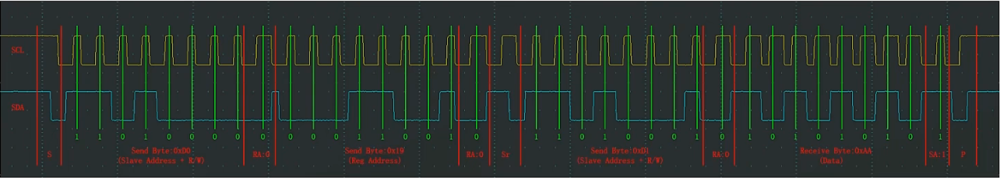

具体实现过程是起始，发送一个字节指定从机地址和读写位（写），接收应答，发送第二个字节指定寄存器地址，重新起始，发送一个字节指定从机地址和读写位（读），接收应答，此时总线控制权交给从机，主机接收一个字节以接收从机发送的数据，主机给从机发送0（不给应答），主机收回总线控制权，终止，返回值为接收到的数据。

```C
uint8_t MPU6050_ReadReg(uint8_t RegAddress)
{
	uint8_t Data;
	
	MyI2C_Start();
	MyI2C_SendByte(MPU6050_ADDRESS);
	MyI2C_ReceiveAck();
	MyI2C_SendByte(RegAddress);
	MyI2C_ReceiveAck();
	
	MyI2C_Start();
	MyI2C_SendByte(MPU6050_ADDRESS | 0x01);
	MyI2C_ReceiveAck();
	Data=MyI2C_ReceiveByte();
	MyI2C_SendAck(1);
	MyI2C_Stop();
	
	return Data;
}
```

若想接收多个字节，就给从机发送应答（0）。

因为需要调用的寄存器较多，在hardware添加一个头文件MPU6050_Reg.h存放。用宏定义将寄存器地址替换为寄存器名称。

```C
#ifndef __MPU6050_REG_H
#define __MPU6050_REG_H

#define	MPU6050_SMPLRT_DIV		0x19
#define	MPU6050_CONFIG			0x1A
#define	MPU6050_GYRO_CONFIG		0x1B
#define	MPU6050_ACCEL_CONFIG	0x1C

#define	MPU6050_ACCEL_XOUT_H	0x3B
#define	MPU6050_ACCEL_XOUT_L	0x3C
#define	MPU6050_ACCEL_YOUT_H	0x3D
#define	MPU6050_ACCEL_YOUT_L	0x3E
#define	MPU6050_ACCEL_ZOUT_H	0x3F
#define	MPU6050_ACCEL_ZOUT_L	0x40
#define	MPU6050_TEMP_OUT_H		0x41
#define	MPU6050_TEMP_OUT_L		0x42
#define	MPU6050_GYRO_XOUT_H		0x43
#define	MPU6050_GYRO_XOUT_L		0x44
#define	MPU6050_GYRO_YOUT_H		0x45
#define	MPU6050_GYRO_YOUT_L		0x46
#define	MPU6050_GYRO_ZOUT_H		0x47
#define	MPU6050_GYRO_ZOUT_L		0x48

#define	MPU6050_PWR_MGMT_1		0x6B
#define	MPU6050_PWR_MGMT_2		0x6C
#define	MPU6050_WHO_AM_I		0x75

#endif
```

在MPU6050.c里引用头文件MPU6050_Reg.h，开始在MPU6050初始化函数中配置寄存器。

**配置电源管理寄存器1**：设备复位0，不复位；睡眠模式0，接触睡眠；循环模式0，不循环；无关位0；温度传感器失能0，不失能；最后三位时钟001，选择陀螺仪时钟。综上，该寄存器**写入0x01**。

**电源管理寄存器2**：前两位循环模式唤醒频率00，不需要；后六位每个轴的待机位全给0，不需要待机。所以该寄存器**写入0x00**。

**采样率分频寄存器**: 值越小数据输出越快，根据需求配置，这里**写入0x09**，10分频。

**配置寄存器**：外部同步三位全0不需要，数字低通滤波器三位根据需求，这里给110，即最平滑的滤波。所以该寄存器**写入0x06**。

**陀螺仪配置寄存器**：前三位自测使能全0，不自测；中间两位满量程选择根据需求，这里给11，最大量程；后三位无关位0。该寄存器**写入0x18**.

**加速度计配置寄存器**：自测000，满量程11，高通滤波器用不到给00。该寄存器**写入0x18**。

在MPU6050初始化函数中完成寄存器配置，完整代码如下：

```C
void MPU6050_Init(void)
{
	MyI2C_Init();
	MPU6050_WriteReg(MPU6050_PWR_MGMT_1,0x01);
	MPU6050_WriteReg(MPU6050_PWR_MGMT_2,0x00);
	MPU6050_WriteReg(MPU6050_SMPLRT_DIV,0x09);
	MPU6050_WriteReg(MPU6050_CONFIG,0x06);
	MPU6050_WriteReg(MPU6050_GYRO_CONFIG,0x18);
	MPU6050_WriteReg(MPU6050_ACCEL_CONFIG,0x18);
}
```

下面书写获取寄存器数据的函数来获取芯片的测量值。

该函数需要返回6个轴的测量值，这里用指针的地址传递实现函数返回多个值。在参数中定义六个指针型变量，在主函数中定义变量，通过指针把主函数变量地址传到子函数，子函数中通过传递来的地址操作主函数的变量，这样子函数结束后主函数变量的值就是子函数想要返回的值。

在子函数中通过指定地址读函数读取寄存器。定义两个变量，分别将读取的寄存器数据的高八位和低八位存在两个变量中，高八位左移8位再或上低八位，就得到一个轴的16位数据，通过指针把数据返回。重复操作，读取所有六个轴的数据。

该函数完整代码如下：

```C
void MPU6050_GetData(int16_t *AccX,int16_t *AccY,int16_t *AccZ,
	                    int16_t *GyroX,int16_t *GyroY,int16_t *GyroZ)
{
    uint8_t DataH,DataL;
	
	DataH = MPU6050_ReadReg(MPU6050_ACCEL_XOUT_H);
	DataL = MPU6050_ReadReg(MPU6050_ACCEL_XOUT_L);
	*AccX = (DataH<<8) | DataL;
	
	DataH = MPU6050_ReadReg(MPU6050_ACCEL_YOUT_H);
	DataL = MPU6050_ReadReg(MPU6050_ACCEL_YOUT_L);
	*AccY = (DataH<<8) | DataL;
	
	DataH = MPU6050_ReadReg(MPU6050_ACCEL_ZOUT_H);
	DataL = MPU6050_ReadReg(MPU6050_ACCEL_ZOUT_L);
	*AccZ = (DataH<<8) | DataL;
	
	DataH = MPU6050_ReadReg(MPU6050_GYRO_XOUT_H);
	DataL = MPU6050_ReadReg(MPU6050_GYRO_XOUT_L);
	*GyroX = (DataH<<8) | DataL;
	
	DataH = MPU6050_ReadReg(MPU6050_GYRO_YOUT_H);
	DataL = MPU6050_ReadReg(MPU6050_GYRO_YOUT_L);
	*GyroY = (DataH<<8) | DataL;
	
	DataH = MPU6050_ReadReg(MPU6050_GYRO_ZOUT_H);
	DataL = MPU6050_ReadReg(MPU6050_GYRO_ZOUT_L);
	*GyroZ = (DataH<<8) | DataL;
	
}
```

将MPU6050.c中的函数在.h文件中声明。

```C
#ifndef __MyI2C_H
#define __MyI2C_H

void MyI2C_Init(void);
void MyI2C_Start(void);
void MyI2C_Stop(void);
void MyI2C_SendByte(uint8_t Byte);
uint8_t MyI2C_ReceiveByte(void);
void MyI2C_SendAck(uint8_t AckBit);
uint8_t MyI2C_ReceiveAck(void);

#endif
```