<font size=5>

# 裸机下驱动蓝牙模块

## 通信接口

通信的目的：将一个设备的数据传送到另一个设备，扩展硬件系统。

通信协议：制定通信的规则，通信双方按照协议规则进行数据收发。

基本需求：STM32芯片内部有定时器计数、PWM输出、AD采集器等电路，这些电路的配置寄存器、数据寄存器都在芯片里，直接读写就能操作。但有些功能是STM32不具备的，如蓝牙无线遥控的功能、陀螺仪测量姿态的功能，要实现这些功能就需要在STM32上外挂芯片。外挂芯片的数据都在STM32之外，必须在两个设备之间连接通信线，STM32通过通信线发送或接受数据，完成数据交换，从而实现控制外挂模块和读取外挂模块数据的目的。STM32内部具有对应的通信外设，可以按照通信协议产生和接收高低电平信号，实现通信。

STM32上常见的通信外设：USART同步/异步串口通信、I2C通信、SPI通信、CAN通信、USB通信。

**基本概念：**

*全双工*：一种双工模式，指通信双方能够同时进行双向通信。一般来说，全双工通信有两根通信线，发送线路和接收线路互不影响。

*半双工*：一种双工模式，指通信双方同一时间只能进行发送或接收。半双工通信使用一根数据线或两根差分线组成一根数据线。

*单工*：一种双工模式，指数据只能由一个设备到另一个设备，不能反过来。例如全双工通信去掉一根线就退化成单工了。

*同步*：一种时钟特性，指接收方可以在时钟信号的指引下进行采样，适用于有时钟线的通信协议。

*异步*：一种时钟特性，对于没有时钟线的通信协议，需要通信双方约定一个采样频率，并且还需要加上一些帧头帧尾等，进行采样位置的对齐。

*单端*：一种电平特性，指引脚的高低电平都是对GND的电压差，所以单端信号通信的双方必须共地，即把GND接在一起。

*差分*：一种电平特性，指通信双方靠两个差分引脚的电压差来传输信号。使用差分信号可极大提高抗干扰性，所以差分信号一般传输速度和距离都非常高，性能也很不错。

*点对点*：一种设备特性，指总线上只能挂载一个设备。

*多设备*：一种设备特性，指能在总线上挂载多个设备。

**要实现蓝牙模块与单片机的交流，需要使用USART串口通信。**

## AT指令配置蓝⽛模块

我使用的是MLT-BT05 4.0 蓝牙模块。查看该蓝牙模块的AT指令集。

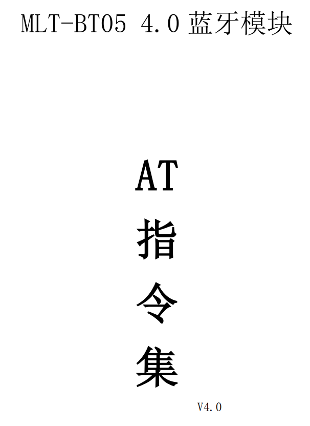

发 AT 指令时必须回车换行（即以字符\r\n结尾）， AT 指令只能在模块未连接状态下才能生效，一旦蓝牙模块与设备连接上，蓝牙模块即进入数据透传模式。调试的波特率为9600。使用资料包附带串口工具发指令不需要输入\r\n，在串口工具上勾选发送回车相当于在指令结尾加上了\r\n。如下图：

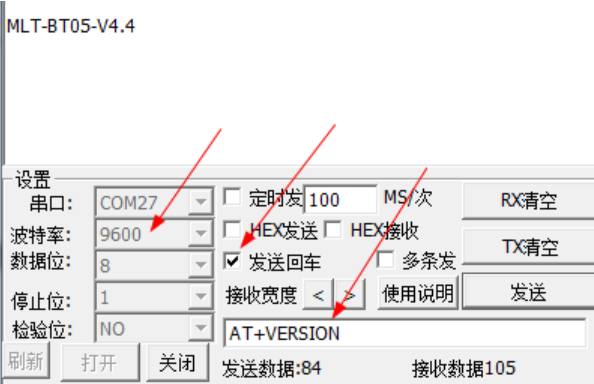

将蓝牙模块与usb-ttl连接，连接方式为3.3V-VCC、TXD-RXD、RXD-TXD、GND-GND（usb-ttl在前）。将usb-ttl插在电脑上，若蓝牙模块上指示灯以大约两秒一次频率闪烁，说明已进入调试模式。打开串口，开始调试：

发送指令“AT”，响应“OK”：

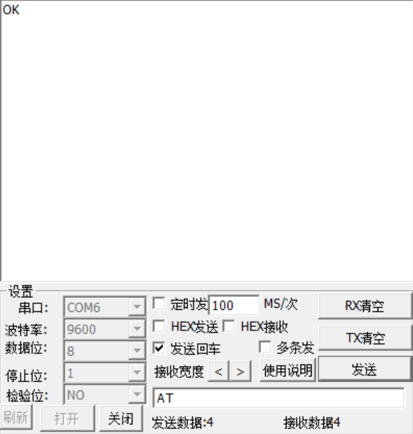

查看软件版本号：

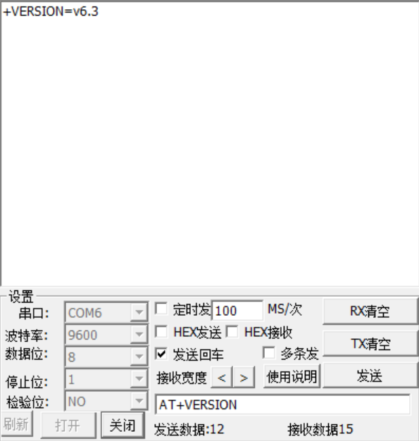

获取模块蓝牙MAC地址：

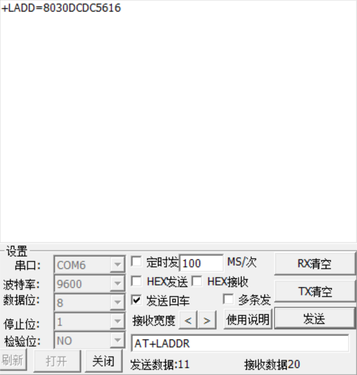

设置设备名称：

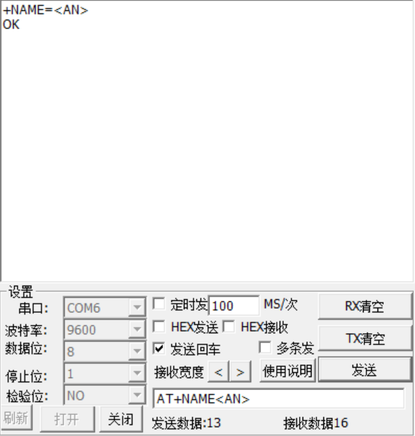

查询配对码：

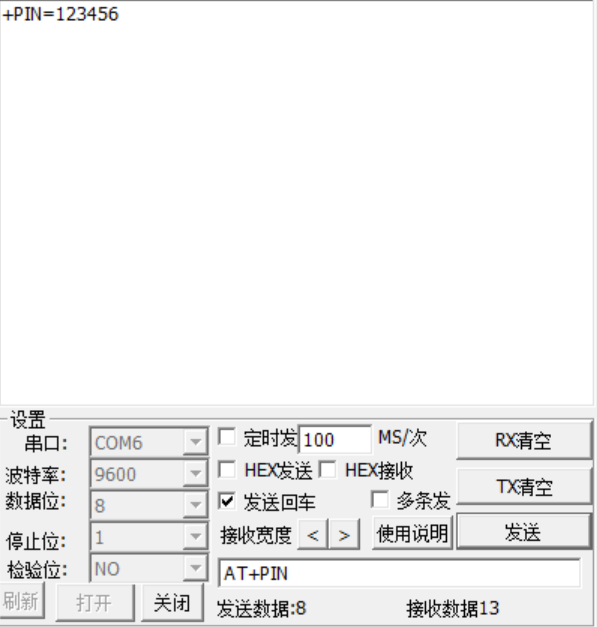

查询串口波特率：

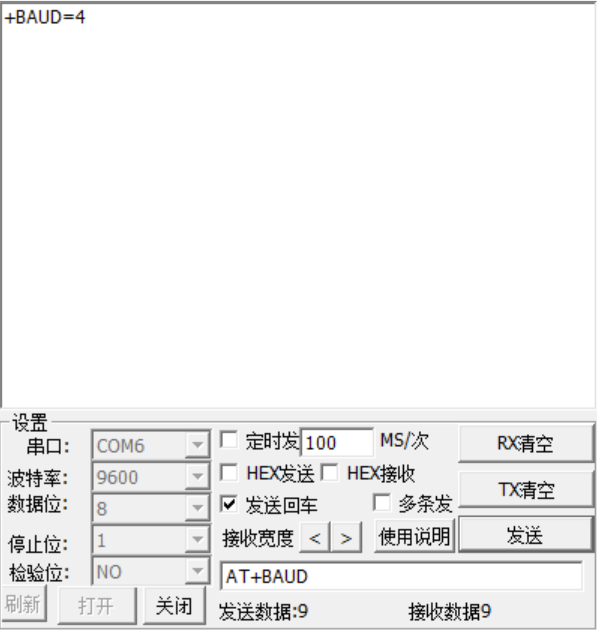

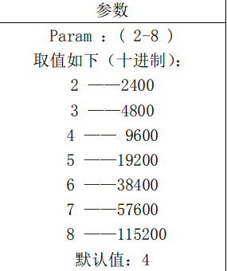

根据参数表知串口波特率为9600。

## 串⼝通信

串口是一种应用十分广泛的通讯接口，串口成本低、容易使用、通信线路简单，可实现两个设备的互相通信（点对点）。单片机的串口可以使单片机与单片机、单片机与电脑、单片机与各式各样的模块互相通信，极大地扩展了单片机的应用范围，增强了单片机系统的硬件实力。

常见串口设备：

1.USB-TTL模块：

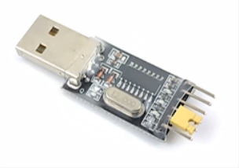

上有CH340芯片，可以把串口协议转换为USB协议，一边是USB口可以插在电脑上，另一边是串口引脚可以和支持串口的芯片连接在一起，以实现串口和电脑的通信。

2.蓝牙模块：

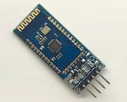

下面四个脚是串口通信引脚，其上的芯片可以和手机互联，实现手机遥控单片机的功能。

硬件电路：

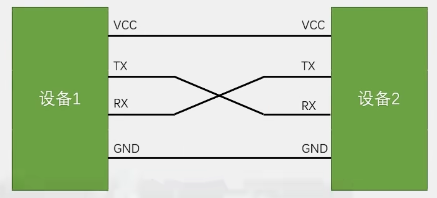

*简单双向串口通信有两根通信线(发送端TX和接收端RX)
*TX与RX要交叉连接
*当只需单向的数据传输时，可以只接一根通信线
*当电平标准不一致时，需要加电平转换芯片

电平标准：

电平标准是数据1和数据0的表达方式，是传输线缆中人为规定的电压与数据的对应关系，串口常用的电平标准有如下三种：

1.TTL电平:+3.3V或+5V表示1，0V表示0

2.RS232电平:-3 ~ -15V表示1，+3 ~ +15V表示0

3.RS485电亚:两线压差+2 ~ +6V表示1，-2 ~ -6V表示0(差分信号)

单片机中最常见的是TTL电平。RS232电平一般在大型机器上使用，因为环境静电干扰较大，所以电平的电压及允许波动的范围都比较大。RS485电平是差分信号，抗干扰能力非常强，通信距离可达上千米，而前两种电平最远只能大到几十米。这些电平在软件层面的程序没有区别。串口协议规定TX发送高低电平，RX接收高低电平，对于TTL电平，若TX对地是3.3V/5V，代表发送了1，若TX对地是0V，代表发送了0。

**串口参数及时序：**

串口协议规定，串口中每一个字节都装在在一个数据帧里面，每个数据帧都由起始位、数据位、停止位组成，数据位有8个，代表一个字节的8位：

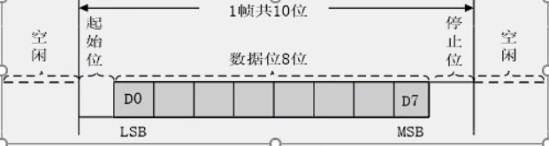

还可以在数据位最后加上奇偶校验位：

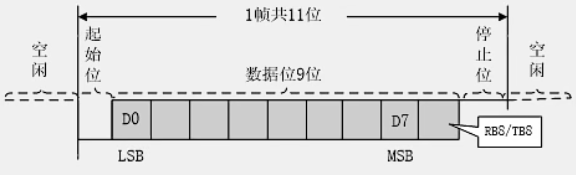

串口参数：

1.波特率：**串口通信的速率**。串口一般使用异步通信，需要双方约定一个通信速率，接收快了会重复接收某些位，接收慢了会漏掉某些位。波特率本意是每秒传输码元个数，在二进制调制情况下，一个码元就是一个bit，此时波特率等于比特率。单片机通常都是二进制调制。例如双方规定波特率为1000bps，就表示1s要发送1000位，即发送方每隔1ms发送一位，接收方每隔1ms接收一位。

2.起始位：**标志一个数据帧的开始，固定为低电平**。串口空闲状态引脚必须置高电平，需要传输时必须先发送一个起始位，起始位必须是低电平，打破空闲状态的高电平，波形产生一个下降沿，告诉接收设备这一帧数据即将开始。如果没有起始位可能会出现发送时一直是高电平的情况（发送8个1），没有任何波动，接收方无法知道发送了数据。

3.数据位：**数据帧的有效载荷，1为高电平，0为低电平，低位先行**。

4.校验位：**用于数据验证，根据数据位计算得来**。使用奇偶校验的方法，可以判断数据传输是否出错，如果出错，可以选择丢弃或要求重传。校验可选择3种方式：无校验、奇校验、偶校验。发送方在发送数据后，奇/偶校验会补一个校验位，保证数据位连同校验位1的总数位奇/偶数；接收方在就收数据后会验证数据位和校验位，如果1的个数还是奇/偶数，就认为数据没有出错。但如果两位数据在传输过程中由于干扰同时出错，就、奇偶特性不变，就校验不出来了。

5.停止位：**用于数据帧间隔，固定为高电平**。同时也是为下一个起始位做准备，如果没有停止位，当发送的数据最后一位是0，再发送新的一帧将无法产生下降沿。

（注：数据位有两种描述方法，一是把数据位和校验位放在一起，有校验位是9位数据位，无校验位是8位数据位；二是把数据位和校验位分开描述。）

**USART外设：**

USART简介：

*USART(Universal Synchronous/Asynchronous Receiver/Transmitter)通用同步/异步收发器
*USART是STM32内部集成的硬件外设，可根据数据寄存器的一个字节数据自动生成数据帧时序，从TX引脚发送出去，也可自动接收RX引脚的数据帧时序，拼接为一个字节数据，存放在数据寄存器里自带波特率发生器，最高达4.5Mbits/s
*可配置数据位长度(8/9) 、停止位长度 (0.5/1/1.5/2)可选校验位 (无校验/奇校验/偶校验)
*支持同步模式、硬件流控制、DMA、智能卡、IrDA、LIN
*STM32F103C8T6 USART资源: USART1、 USART2、 USART3

USART框图：

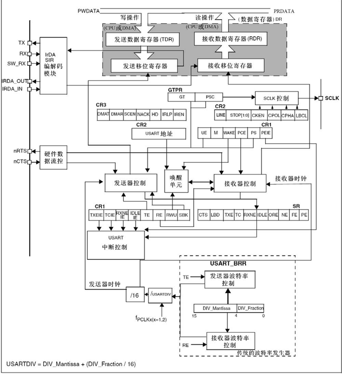

灰框中是串口数据寄存器，存储发送或接收的数据。

发送数据寄存器（TDR）和接收数据寄存器（RDR）占用同一个地址，在程序上只表现为一个寄存器，即数据寄存器（DR），在硬件中分为两个寄存器，TDR只写，RDR只读，进行写操作时数据写入TDR，进行读操作时从RDR中读出数据。

移位寄存器分为发送移位寄存器和接收移位寄存器。发送移位寄存器的作用是把一个字节的数据一位一位移出到TX引脚，向右移位即低位先行。当数据移位完成后，标志位TXE（TX Empty）置1，新的数据会自动从TDR转移到发送移位寄存器，如果当前移位没有完成，TDR的数据会等待。TDR和移位寄存器的双重缓存可以保证连续发送数据时数据帧之间不会有空闲，提高了工作效率。

对于接收移位寄存器，数据从RX引脚通入接收移位寄存器，在接收器控制的驱动下一位位读取RX电平，先放在最高位然后向右移，移位8次就能接收一个字节，当一个字节移位完成后，整体转移到RDR内。转移过程中置标志位RXNE（RX Not Empty）为1，检测到即可把数据读走。

最下面时波特率发生器部分，APB时钟进行分频，得到发送和接收移位的时钟。USART1挂载在APB2，是PCLK2的时钟，一般是72M，其他USART挂载在APB1，是PCLK1的时钟，一般是36M。之后时钟进行分频，除以USARTDIV的分频系数，分频系数支持小数点后四位减小除不尽的误差。分频后再除以16，得到发送器时钟和接收器时钟，通向控制部分。如果TE（TX Enable）为1，发送器使能，发送部分的波特率有效；如果RE（RX Enable）为1，接收器使能，接收部分的波特率有效。

计算公式：波特率 = fPCLK2/1 / (16 * DIV)


USART基本结构：

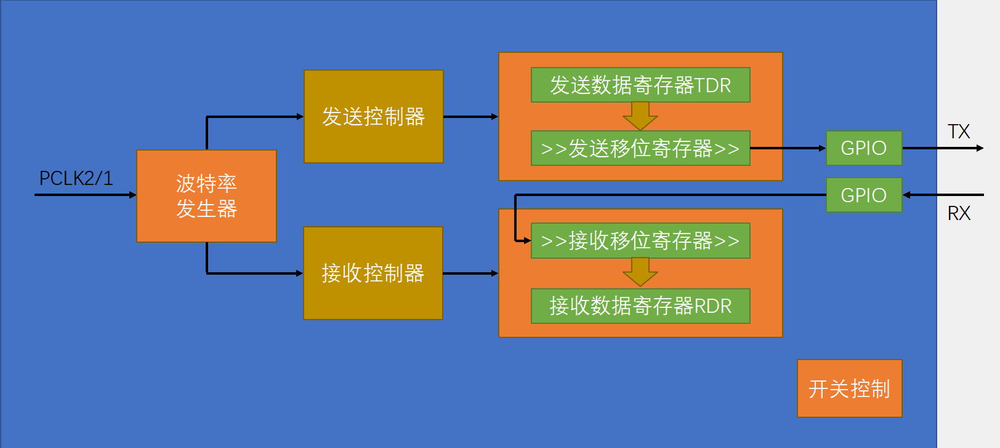

## 串口发送+接收实现蓝牙模块与单片机交流

计划使用USART1进行通信，查看STM32引脚定义表：

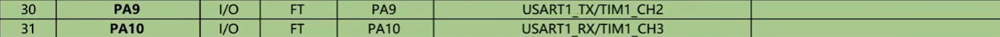

可以看到USART1的TX是PA9，RX是PA10。所以将蓝牙模块连接到面包板上与单片机接在一起，VCC接+、GND接-、RXD接PA9、TXD接PA10。

建立Serial.c、.h模块，书写代码实现串口发送+接收。

**调用库函数初始化USART：**

1.开启时钟，把需要用的USART和GPIO时钟打开。

```C

RCC_APB2PeriphClockCmd(RCC_APB2Periph_USART1,ENABLE);
RCC_APB2PeriphClockCmd(RCC_APB2Periph_GPIOA,ENABLE);

```

开启USART1和GPIOA的时钟。

2.GPIO初始化，把TX配置成复用输出，RX配置成输入。

```C

GPIO_InitTypeDef GPIO_InitStructure;
GPIO_InitStructure.GPIO_Mode = GPIO_Mode_AF_PP;
GPIO_InitStructure.GPIO_Pin = GPIO_Pin_9;
GPIO_InitStructure.GPIO_Speed = GPIO_Speed_50MHz;
GPIO_Init(GPIOA, &GPIO_InitStructure);

GPIO_InitStructure.GPIO_Mode = GPIO_Mode_IPU;
GPIO_InitStructure.GPIO_Pin = GPIO_Pin_10;
GPIO_InitStructure.GPIO_Speed = GPIO_Speed_50MHz;
GPIO_Init(GPIOA, &GPIO_InitStructure);

```

PA9配置成复用推挽输出，供TX引脚使用；PA10配置成上拉输入，供RX引脚使用。

3.配置USART。

```C

USART_InitTypeDef USART_InitStructure;
USART_InitStructure.USART_BaudRate = 9600;
USART_InitStructure.USART_HardwareFlowControl = USART_HardwareFlowControl_None;
USART_InitStructure.USART_Mode = USART_Mode_Tx | USART_Mode_Rx;
USART_InitStructure.USART_Parity = USART_Parity_No;
USART_InitStructure.USART_StopBits = USART_StopBits_1;
USART_InitStructure.USART_WordLength = USART_WordLength_8b;
USART_Init(USART1,&USART_InitStructure);

```

已知蓝牙模块串口波特率为9600（函数内部会自动算好9600对应的分频系数），不适用流控，串口模式发送+接收，不需要校验位，停止位1位，字长8位。

4.配置中断以实现接收功能。

```C

USART_ITConfig(USART1, USART_IT_RXNE, ENABLE);
	
NVIC_PriorityGroupConfig(NVIC_PriorityGroup_2);
	
NVIC_InitTypeDef NVIC_InitStructure;
NVIC_InitStructure.NVIC_IRQChannel = USART1_IRQn;
NVIC_InitStructure.NVIC_IRQChannelCmd = ENABLE;
NVIC_InitStructure.NVIC_IRQChannelPreemptionPriority = 1;
NVIC_InitStructure.NVIC_IRQChannelSubPriority = 1;
NVIC_Init(&NVIC_InitStructure);

```

开启中断，开启RXNE标志位到NVIC的输出；分组；初始化NVIC到USART1的通道。当RXNE标志位置1，就会向NVIC申请中断，可以在中断函数里接收数据。

最后：
```C

USART_Cmd(USART1,ENABLE);

```

整个USART的初始化就完成了。完整代码如下：

```C

void Serial_Init(void)
{
    RCC_APB2PeriphClockCmd(RCC_APB2Periph_USART1,ENABLE);
	RCC_APB2PeriphClockCmd(RCC_APB2Periph_GPIOA,ENABLE);
	
	GPIO_InitTypeDef GPIO_InitStructure;
	GPIO_InitStructure.GPIO_Mode = GPIO_Mode_AF_PP;
	GPIO_InitStructure.GPIO_Pin = GPIO_Pin_9;
	GPIO_InitStructure.GPIO_Speed = GPIO_Speed_50MHz;
	GPIO_Init(GPIOA, &GPIO_InitStructure);
	
	GPIO_InitStructure.GPIO_Mode = GPIO_Mode_IPU;
	GPIO_InitStructure.GPIO_Pin = GPIO_Pin_10;
	GPIO_InitStructure.GPIO_Speed = GPIO_Speed_50MHz;
	GPIO_Init(GPIOA, &GPIO_InitStructure);
	
	USART_InitTypeDef USART_InitStructure;
	USART_InitStructure.USART_BaudRate = 9600;
	USART_InitStructure.USART_HardwareFlowControl = USART_HardwareFlowControl_None;
	USART_InitStructure.USART_Mode = USART_Mode_Tx | USART_Mode_Rx;
	USART_InitStructure.USART_Parity = USART_Parity_No;
	USART_InitStructure.USART_StopBits = USART_StopBits_1;
	USART_InitStructure.USART_WordLength = USART_WordLength_8b;
	USART_Init(USART1,&USART_InitStructure);
	
	USART_ITConfig(USART1, USART_IT_RXNE, ENABLE);
	
	NVIC_PriorityGroupConfig(NVIC_PriorityGroup_2);
	
	NVIC_InitTypeDef NVIC_InitStructure;
	NVIC_InitStructure.NVIC_IRQChannel = USART1_IRQn;
	NVIC_InitStructure.NVIC_IRQChannelCmd = ENABLE;
	NVIC_InitStructure.NVIC_IRQChannelPreemptionPriority = 1;
	NVIC_InitStructure.NVIC_IRQChannelSubPriority = 1;
	NVIC_Init(&NVIC_InitStructure);
	
	USART_Cmd(USART1,ENABLE);
}

```

**书写发送和接收数据的函数：**

1.发送数据：

```C

void Serial_SendByte(uint8_t Byte)
{
    USART_SendData(USART1, Byte);
	while(USART_GetFlagStatus(USART1,USART_FLAG_TXE)==RESET);
}

```

调用串口USART_SendData函数，把参数传递给该函数，就能把数据写入TDR寄存器，最后移位寄存器把数据移除TX引脚，完成数据发送。需要等待TDR数据转移到移位寄存器，即等待TXE标志位置1，否则一直循环，防止数据覆盖。查看手册，标志位不需要手动清除，写操作会自动清零。

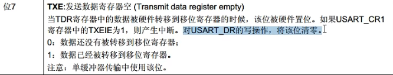

该函数可以一次发送一个字节数据或一个字符。通过对该函数的封装，书写其他发送函数。

2.发送一个数组：

```C

void Serial_SendArray(uint8_t *Array, uint16_t Length)
{
    uint16_t i;
	for(i=0; i<Length; i++)
	{
	    Serial_SendByte(Array[i]);
	}
}

```

依次取出数组每一位发送。

3.发送一个字符串：

```C

void Serial_SendString(char *String)
{
    uint8_t i;
	for(i=0; String[i]!='\0'; i++)
	{
	    Serial_SendByte(String[i]);
	}
}

```

通过字符串的结束标志位判断循环是否结束，一次发送字符串每一位。

4.发送一个无符号数：

```C

void Serial_SendNumber(uint32_t Number, uint8_t Length)
{
    uint8_t i;
	for(i=0; i<Length; i++)
	{
	    Serial_SendByte(Number / Serial_Pow(10, Length - i - 1) % 10 + '0');
	}
}

```

由高位到低位发送数据，因为要以字符形式显示，再每一位加上'0'。为将数字拆分成各位，需要写一个pow函数，返回x的y次方：

```C

uint32_t Serial_Pow(uint32_t x,uint32_t y)
{
    uint32_t Result = 1;
	while(y--)
	{	
		Result *=x;
	}
	return Result;
}

```

5.发送一个有符号数：

```C

void Serial_SendSignedNumber(int32_t Number, uint8_t Length)
 {
     uint8_t i;
	 uint32_t Number1;
	 if(Number>=0)
	 {
	     Serial_SendByte(0x2B);
		 Number1 = Number;
	 }
	 else
	 {
	     Serial_SendByte(0x2D);
		 Number1 = -Number;
	 }
	 Serial_SendNumber(Number1, Length);
 }

```

封装发送一个无符号数函数，实现发送一个有符号数。

6.在中断函数里接收数据：

```C

uint8_t Serial_RxData;
uint8_t Serial_RxFlag;

uint8_t Serial_GetRxFlag(void)
{
    if(Serial_RxFlag == 1)
	{
	    Serial_RxFlag = 0;
		return 1;
	}
	return 0;
}

uint8_t Serial_GetRxData(void)
{
    return Serial_RxData;
}

void USART1_IRQHandler(void)
{
    if(USART_GetITStatus(USART1, USART_IT_RXNE)== SET)
	{
	    Serial_RxData = USART_ReceiveData(USART1);
		Serial_RxFlag = 1;
		USART_ClearITPendingBit(USART1, USART_IT_RXNE);
	}
}

```

第三个函数当RDR中接收到数据，将读取的RDR中的数据存在一个变量里，并置一个自己的标志位（flag），最后清除RXNE标志位；第一个函数读后自动清除flag标志位；第二个函数返回存储了读取数据的变量。

将所有函数名称在.h文件里声明，串口模块就封装好了。

```C

#ifndef __SERIAL_H
#define __SERIAL_H

#include <stdio.h>

void Serial_Init(void);
void Serial_SendByte(uint8_t Byte);
void Serial_SendArray(uint8_t *Array, uint16_t Length);
void Serial_SendString(char *String);
void Serial_SendNumber(uint32_t Number, uint8_t Length);
void Serial_SendSignedNumber(int32_t Number, uint8_t Length);

uint8_t Serial_GetRxFlag(void);
uint8_t Serial_GetRxData(void);

#endif

```

## 单片机通过蓝牙模块向手机发送“姓名+学号”：

将蓝牙模块连接到面包板上与单片机接在一起，VCC接+、GND接-、RXD接PA9、TXD接PA10。

在主函数里写程序实现蓝牙向手机发送“姓名+学号”：

```C

#include "stm32f10x.h"                  // Device header
#include "Serial.h"

char A[24]={'X','u',' ','H','a','n','g','a','n',':','2','0','2','3','0','9','0','9','0','5','0','0','8'};

int main(void)
{
	Serial_Init();
    Serial_SendString(A);
	
	while (1)
	{}
}

```

手机接收：

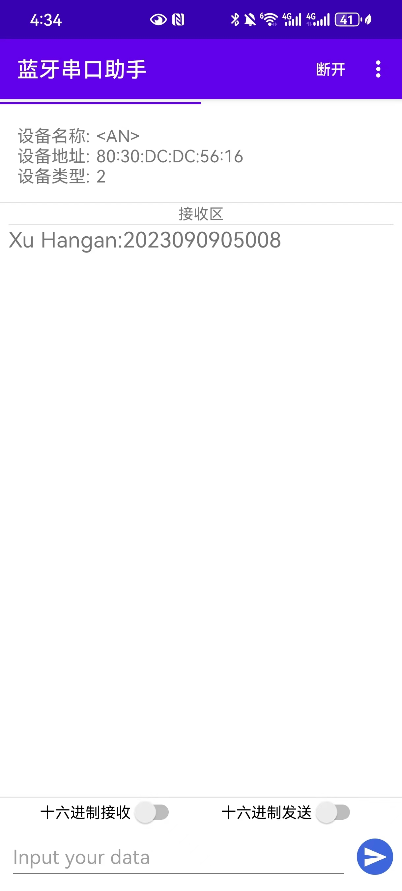

